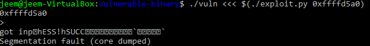
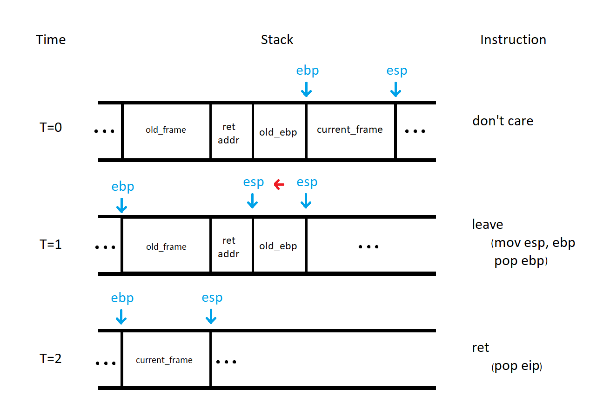
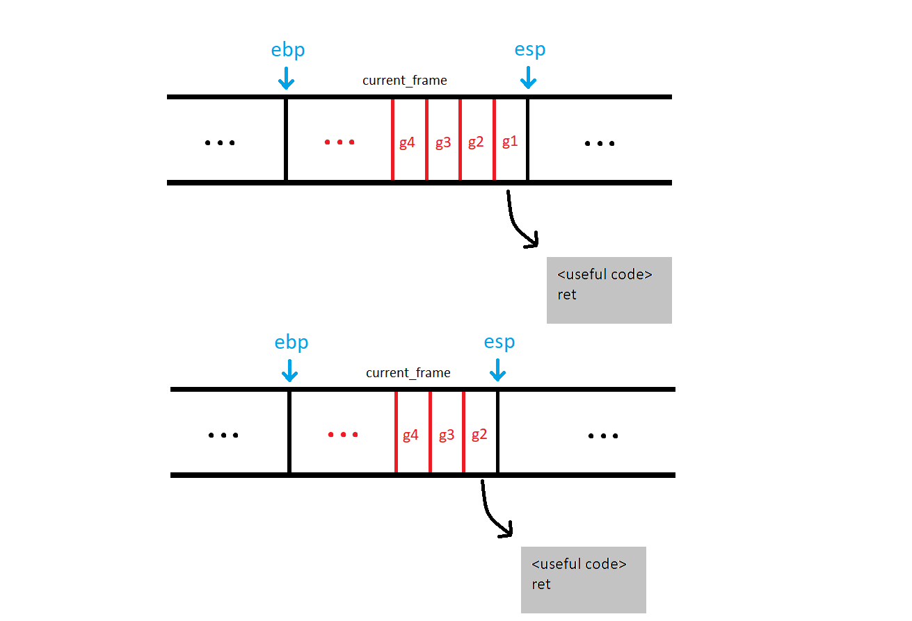

# Return-Oriented Programming (ROP)

[Last week](http://j33m.net/2017/12/06/shellcode/), I went over Shellcoding and provided an example of how you can get arbitrary code to run due to a buffer overflow vulnerability in a simple program. I began by compiling the target application with a bunch of flags that turn off various mitigation techniques. One such mitigation technique is non-executable (NX) stack memory. In modern machines, when a process is started and its address space is created, the operating system will mark user controlled memory as NX so that if an attacker is able to gain control of the value of the program counter, they cannot simply jump to code that they have written to the stack or the heap. Because of this mitigation technique, the exploit that we developed last time is useless.



This segmentation fault occurs because the program tries to execute code that is marked NX. The operating system catches this and terminates the process.

## What is ROP?

Return-Oriented programming is an exploitation technique that allows an attacker to execute code even when user controlled data is flagged as non-executable. This is accomplished by writing a series of addresses to instructions found within the target application/dynamic libraries it depends on. An attacker is able to put together pieces of a vulnerable application to achieve some end goal (usually open a shell).

#### Gadget

A gadget is a single chunk of code generally followed by a `ret` that is chained with other gadgets. Some useful tools such as [ROPgadget](https://github.com/JonathanSalwan/ROPgadget) can help you find useful gadgets in a binary.

#### Ropchain

A ropchain is a full program written with return-oriented programming consisting of a collection of gadgets.

### How it Works

ROP works because of the calling convention in x86. At the end of a function, registers are cleaned up with a `leave` instruction. This instruction is functionally the same as `mov esp, ebp; pop ebp`. Following the `leave` instruction is a `ret`. This instruction is functionally equivilant to `pop eip`. 



In the figure above, we can see the effect of the `leave` instruction at T=1. At the end of this instruction, `esp` points at the old return address `ebp` points at the base of the calling stack frame. At T=2, the return address stored on the stack is popped and `eip` is set. In normal execution, this would be the end of this interesting mechanism and the calling function would continue execution. In the ROP case, the return address is the address of a gadget that ends in a `ret` instruction.



Once the first gadget in the chain is done, the `ret` instruction is executed. This is the same as `pop eip`, so the program counter now goes to the second gadget since it is now at the top of the stack. This chain of addresses continues to execute until a gadget ends without a `ret`. The final gadget usually ends in a `call` or an `int` instruction since we typically set up a function to call.


## Building a Ropchain

No matter what your goal is when developing a ropchain, you probably need to find certain patterns of gadgets to achieve your goal. 

#### Setting Registers

The first thing that you want when developing a ropchain is control over the registers. To gain control of a register, look for a gadget that contains `pop rXX` This will allow you to set the value of `rXX` to a value within user-controlled data. For example, the perfect gadget to set the `rcx` register would be:
```asm
pop rcx
ret
```
This gadget only sets the `rcx` register without any side effects. It is not always possible to obtain an ideal gadget, but you should look for gadgets that have minimal side effects.

#### Write-What-Where

The next step for common ROP use case is to write a string or some other data somewhere in memory. This can be accomplished by chaining a bunch of write-what-where gadgets. These gadgets contain instructions that look like: `mov [reg1], reg2` where `reg1` and `reg2` are registers that you have control of from the previous section. This allows you to write any value to any address in memory that the process has access to.

#### Calling Some Function

Finally, you probably want to call some function based on the system that you are exploiting. In linux, you usually want to invoke `system()` or some function in the `exec()` family. In Windows, you want to call something like `LoadLibrary()` or `CreateProcess()`. Calling these functions is as simple as setting up the registers and stack for the call, then returning to the address of one of these functions.

## Tips for ROP
  * Construct the chain in a script. You can build high level functions out of lower level functions created directly from the program.
  * Avoid gadgets that modify the stack. If the stack is modified, you will have to take this into account to make sure the chain continues.
  * Find gadgets in `libc.so`, `ntdll.dll`, or `kernel32.dll`. These large binaries are always in memory. If you can get the base address of these, you get a lot more to choose from.


## Mitigating ROP

To help mitigate the possibility of an attacker using ROP to exploit a program. A developer can take advantage of [Address Space Layout Randomization (ASLR)](https://en.wikipedia.org/wiki/Address_space_layout_randomization). This mitigation technique randomizes the address of a process in memory, forcing an attacker to either guess the address of gadgets or somehow leak that information. This mitigation technique is implemented by default by all modern operating systems. 

To prevent user control of the program counter, developers need to pay close attention to avoid bugs that can lead to an overwrite of the return address on the stack. The use of [stack canaries](https://en.wikipedia.org/wiki/Buffer_overflow_protection#Canaries) can also help mitigate the control that an attacker can achieve without first leaking values on the stack. Most compilers implement this technique by default.

#### Other Resources

To learn more about return-oriented programming, I recommend watching [this video by Gynvael Coldwind](https://www.youtube.com/watch?v=iwRSFlZoSCM). He explains the process that he uses when building a ropchain and explains everything clearly. [ROP Emporium](https://ropemporium.com/) is a nice wargaming website that consists exclusivly of ROP challenges.